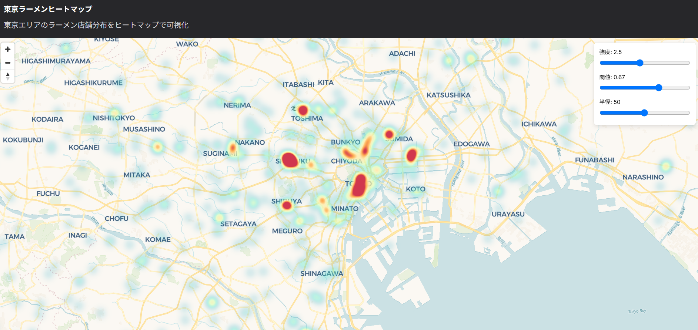

# 東京ラーメンヒートマップ



OpenStreetMap の Overpass API を利用し、東京都内のラーメン店の位置情報をヒートマップで可視化する Web アプリケーション。

## 概要

- クライアントサイドで Overpass API へ直接クエリを投げ、ラーメン店データを取得
- deck.gl の HeatmapLayer を使った密度可視化
- MapLibre GL + Carto のベースマップを表示
- ヒートマップの色、半径、閾値などを UI から動的に調整可能

## 技術スタック

- Next.js 14 (App Router)
- React
- TypeScript
- deck.gl
- react-map-gl (MapLibre GL 統合)
- Chakra UI

## セットアップ

### 前提条件

- Node.js 16.8.0 以上

### インストール＆起動

```bash
# リポジトリをクローン
git clone https://github.com/yourusername/ramen-heatmap.git
cd ramen-heatmap

# 依存パッケージをインストール
npm install
# または yarn

# 開発サーバーを起動
npm run dev
# または yarn dev
```

ブラウザで http://localhost:3000 を開くとアプリが起動します。

## 主な機能

- 東京都内のラーメン店分布をヒートマップで可視化
- ズームや回転に応じて表示を更新
- ヒートマップの視覚設定をスライダーで調整

## フォルダ構成

```
ramen-heatmap/
├─ app/                 # Next.js App Router
│  ├─ layout.tsx        # RootLayout, favicon 設定
│  ├─ page.tsx          # メインページ
│  └─ providers.tsx     # UseCase 層のコンテキスト提供
├─ src/
│  ├─ application/      # ユースケース
│  ├─ domain/           # ドメインモデル／リポジトリ定義
│  ├─ infrastructure/   # Overpass API クライアント、リポジトリ実装
│  └─ presentation/     # React コンポーネント／ViewModel
├─ public/              # 静的アセット (favicon.svg など)
├─ README.md            # このファイル
└─ package.json
```

## ライセンス

MIT

## 謝辞

- データ: © OpenStreetMap contributors
- 可視化: deck.gl & react-map-gl
- マップ: © Mapbox
